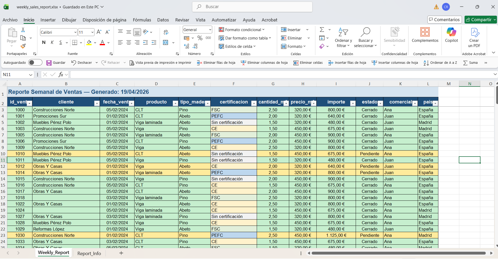

# excel-report-formatter

**ES** | [EN](#en)

---

## ES

Automatiza la generación de reportes Excel semanales listos para negocio a partir de datasets ya limpios.

### ¿Qué problema resuelve?

Los equipos de ventas reciben datos limpios pero sin estructura visual. Formatear manualmente un informe semanal en Excel — anchos de columna, colores por estado, totales, formatos de fecha y moneda — consume tiempo y genera inconsistencias entre semanas o entre personas.

Este módulo automatiza ese proceso: recibe un dataset ya limpio y entrega un Excel profesional, listo para usar en oficina.

**Input:** Excel limpio (output de `excel-data-cleaner`)
**Output:** Excel formateado listo para uso operativo semanal

### ¿A quién va dirigido?

- Equipos de ventas que reciben un informe semanal en Excel
- Organizaciones que trabajan con datos operativos en hojas de cálculo
- Pipelines de datos que necesitan una capa de presentación reproducible

### ¿En qué beneficia al negocio?

- Elimina el trabajo manual de formateo semanal
- Garantiza consistencia visual entre reportes
- Permite leer dos dimensiones simultáneamente: estado comercial de la venta y tipo de certificación
- Produce un entregable profesional sin intervención humana

---

### Resultado

Un archivo Excel listo para uso en oficina con:
- Datos alineados y formateados profesionalmente
- Colores operativos por estado (cerrado, pendiente, cancelado)
- Certificación destacada a nivel de celda
- Totales calculados automáticamente

### Capturas de pantalla

**Hoja Weekly_Report**


**Hoja Report_Info**


---

### Qué hace este proyecto

Recibe el output del módulo `excel-data-cleaner` y genera un reporte Excel con:

- **Hoja `Weekly_Report`**: tabla de datos con título, cabecera estilizada, colores condicionales por estado y certificación, fila de totales y filtros
- **Hoja `Report_Info`**: metadatos del reporte (fecha de generación, archivo fuente, métricas básicas)

#### Colores condicionales

| Columna | Valor | Color |
|---|---|---|
| `estado` | Cerrado | Verde suave |
| `estado` | Pendiente | Amarillo suave |
| `estado` | Cancelado | Rojo suave |
| `certificacion` | FSC | Verde muy suave |
| `certificacion` | PEFC | Azul medio |
| `certificacion` | CE | Amarillo muy suave |
| `certificacion` | Sin certificación | Gris suave |

> La fila completa se colorea por `estado`. La celda `certificacion` tiene su propio color independiente, permitiendo leer ambas dimensiones a la vez.

---

### Lugar en el pipeline

Este módulo forma parte de un pipeline mayor de automatización Excel:

```
excel-sales-consolidator   →   excel-data-cleaner   →   excel-report-formatter
   (ingesta y consolidación)      (limpieza)               (presentación)
```

En una fase posterior, se integrará en una arquitectura cloud (AWS + Streamlit) para ingestión automática y análisis sobre base de datos.

---

### Decisiones técnicas

El diseño técnico prioriza simplicidad, rendimiento y separación de responsabilidades.

| Decisión | Alternativa considerada | Motivo |
|---|---|---|
| `xlsxwriter` como motor principal | `openpyxl` | Más directo para crear desde cero con formato completo |
| `openpyxl` solo para lectura (vía pandas) | Motor único | `pandas.read_excel()` lo requiere internamente |
| Hoja única operativa | KPIs + Pivot + Charts en v1 | Mantener responsabilidad clara: presentación ≠ análisis |
| Caché de formatos | `add_format()` por celda | Escalabilidad y rendimiento en archivos grandes |
| Color de fila por `estado`, celda por `certificacion` | Jerarquía estado > cert > zebra | La jerarquía anulaba visualmente la certificación |
| Formatter como módulo independiente | Integrado en el cleaner | Separación de responsabilidades, reutilizable en el pipeline |

---

### Estructura del proyecto

```
excel-report-formatter/
├── data/
│   └── raw/                        ← Excel limpio de entrada
├── docs/
│   └── screenshots/
│       ├── weekly_report_sheet.png
│       └── info_report_sheet.png
├── outputs/                        ← Reporte generado
├── src/
│   ├── formatter.py                ← Lógica de formato y generación
│   └── main.py                     ← Orquestador y CLI
└── requirements.txt
```

---

### Instalación y uso

```bash
# Instalar dependencias
pip install -r requirements.txt

# Ejecutar con rutas por defecto
python src/main.py

# Ejecutar con rutas personalizadas
python src/main.py --input data/raw/mi_archivo.xlsx --output outputs/mi_reporte.xlsx
```

**Salida esperada:**
```
==========================================
  Excel Report Formatter
==========================================

[1] Cargando Excel limpio...
    ✓ cleaned_sales_report.xlsx — 185 filas × 12 columnas

[2] Validando columnas...
    ✓ Esquema correcto

[3] Generando reporte...
    ✓ Reporte guardado: outputs/weekly_sales_report.xlsx

Resumen:
  Filas procesadas    : 185
  Ventas cerradas     : 153 (83%)
  Ventas certificadas : 148 (80%)
  Output              : outputs/weekly_sales_report.xlsx
```

---

### Requisitos

- Python 3.11+
- pandas >= 2.x
- openpyxl >= 3.x
- xlsxwriter >= 3.x

---

### Contrato del pipeline

```
Input  : Excel limpio con 12 columnas estándar (output de excel-data-cleaner)
Output : Excel formateado con hoja Weekly_Report + Report_Info
```

Columnas requeridas: `id_venta`, `cliente`, `fecha_venta`, `producto`, `tipo_madera`, `certificacion`, `cantidad_m3`, `precio_m3`, `importe`, `estado`, `comercial`, `pais`

> El formatter asume que el input está normalizado. La validación de datos corresponde al módulo `excel-data-cleaner`.

---

### Futuras mejoras

- Integración en pipeline automatizado (AWS S3 + Lambda)
- Generación de reportes analíticos (KPIs, gráficos, tablas pivot)
- Soporte para plantillas Excel personalizadas
- Parametrización de reglas visuales vía fichero de configuración

---

---

## EN

Automates the generation of business-ready weekly Excel reports from already-clean datasets.

### What problem does it solve?

Sales teams receive clean data but without visual structure. Manually formatting a weekly Excel report — column widths, status colours, totals, date and currency formats — takes time and creates inconsistencies between weeks or team members.

This module automates that process: it receives an already-clean dataset and delivers a professional, office-ready Excel file.

**Input:** Clean Excel (output of `excel-data-cleaner`)
**Output:** Formatted Excel ready for weekly operational use

### Who is it for?

- Sales teams that receive a weekly Excel report
- Organisations working with operational data in spreadsheets
- Data pipelines that need a reproducible presentation layer

### Business value

- Eliminates manual weekly formatting work
- Guarantees visual consistency across reports
- Allows reading two dimensions simultaneously: commercial status and certification type
- Produces a professional deliverable with no human intervention

---

### Result

An office-ready Excel file with:
- Professionally aligned and formatted data
- Operational colours by status (closed, pending, cancelled)
- Certification highlighted at cell level
- Automatically calculated totals

---

### What this project does

Receives the output of the `excel-data-cleaner` module and generates an Excel report with:

- **`Weekly_Report` sheet**: data table with title, styled header, conditional colours by status and certification, totals row and filters
- **`Report_Info` sheet**: report metadata (generation date, source file, basic metrics)

#### Conditional colours

| Column | Value | Colour |
|---|---|---|
| `estado` | Cerrado | Soft green |
| `estado` | Pendiente | Soft yellow |
| `estado` | Cancelado | Soft red |
| `certificacion` | FSC | Very soft green |
| `certificacion` | PEFC | Medium blue |
| `certificacion` | CE | Very soft yellow |
| `certificacion` | Sin certificación | Soft grey |

> The full row is coloured by `estado`. The `certificacion` cell has its own independent colour, allowing both dimensions to be read simultaneously.

---

### Place in the pipeline

This module is part of a larger Excel automation pipeline:

```
excel-sales-consolidator   →   excel-data-cleaner   →   excel-report-formatter
   (ingestion & consolidation)     (cleaning)               (presentation)
```

In a later phase, it will be integrated into a cloud architecture (AWS + Streamlit) for automatic ingestion and database analytics.

---

### Technical decisions

The technical design prioritises simplicity, performance and separation of concerns.

| Decision | Alternative considered | Reason |
|---|---|---|
| `xlsxwriter` as main engine | `openpyxl` | More direct for creating from scratch with full formatting |
| `openpyxl` for reading only (via pandas) | Single engine | Required internally by `pandas.read_excel()` |
| Single operational sheet | KPIs + Pivot + Charts in v1 | Clear responsibility: presentation ≠ analysis |
| Format cache | `add_format()` per cell | Scalability and performance on larger files |
| Row colour by `estado`, cell by `certificacion` | estado > cert > zebra hierarchy | Hierarchy visually cancelled out certification |
| Formatter as independent module | Integrated in cleaner | Separation of concerns, reusable in the pipeline |

---

### Project structure

```
excel-report-formatter/
├── data/
│   └── raw/                        ← Clean input Excel
├── docs/
│   └── screenshots/
│       ├── weekly_report_sheet.png
│       └── info_report_sheet.png
├── outputs/                        ← Generated report
├── src/
│   ├── formatter.py                ← Formatting logic and report generation
│   └── main.py                     ← Orchestrator and CLI
└── requirements.txt
```

---

### Installation and usage

```bash
# Install dependencies
pip install -r requirements.txt

# Run with default paths
python src/main.py

# Run with custom paths
python src/main.py --input data/raw/my_file.xlsx --output outputs/my_report.xlsx
```

---

### Requirements

- Python 3.11+
- pandas >= 2.x
- openpyxl >= 3.x
- xlsxwriter >= 3.x

---

### Pipeline contract

```
Input  : Clean Excel with 12 standard columns (output of excel-data-cleaner)
Output : Formatted Excel with Weekly_Report + Report_Info sheets
```

Required columns: `id_venta`, `cliente`, `fecha_venta`, `producto`, `tipo_madera`, `certificacion`, `cantidad_m3`, `precio_m3`, `importe`, `estado`, `comercial`, `pais`

> The formatter assumes the input is already normalised. Data validation is the responsibility of the `excel-data-cleaner` module.

---

### Future improvements

- Integration in automated pipeline (AWS S3 + Lambda)
- Analytical report generation (KPIs, charts, pivot tables)
- Support for custom Excel templates
- Visual rules parametrisation via configuration file